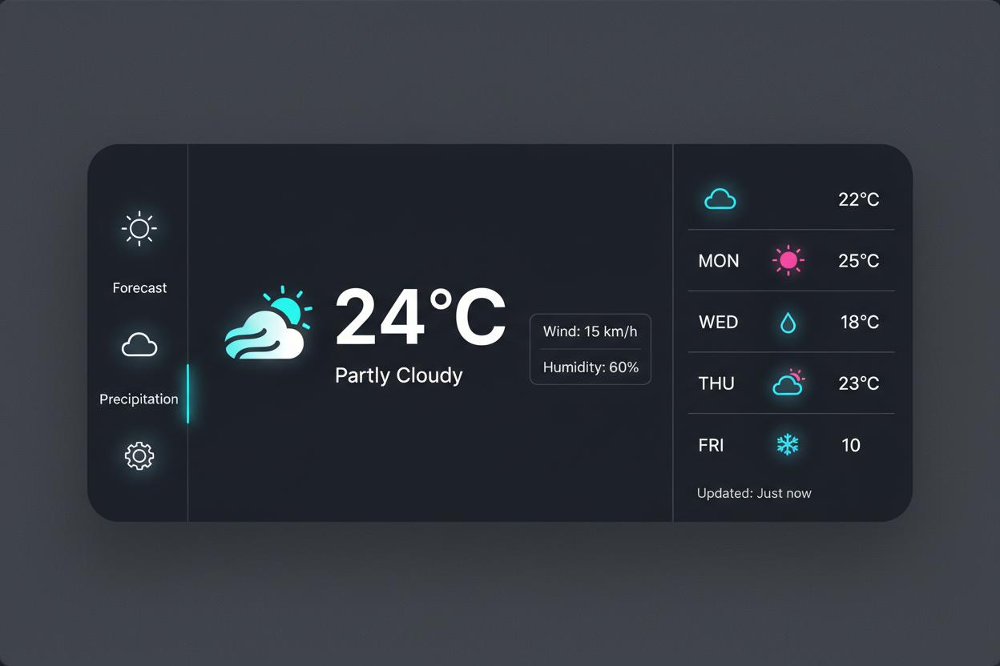

# SkyLens — Weather Dashboard

Real-time weather dashboard with an interactive 3D Earth globe, glassmorphism UI,
and PWA support. Vanilla HTML/CSS/JS frontend, Bun static server for local dev,
Vercel serverless functions for production.



## Features

| Area | What you get |
|------|--------------|
| Current weather | Temp, feels-like comparison arrow, condition + emoji, high/low, humidity, wind + compass, pressure, visibility, cloud cover, sunrise/sunset, daylight length, dew point, wind gusts, UV index |
| Hourly forecast | Next 8 hours with icons, temps, precipitation chance, "Now" highlight |
| Daily forecast | Up to 16 days (Open-Meteo) with temp-range bars, PoP, gusts, UV max, expandable day detail |
| Air quality | AQI + PM2.5/PM10/O3/NO2/SO2/CO breakdown with WHO-based health advice |
| Alerts | NWS severe-weather alerts for US locations, severity color-coded |
| 3D globe (CesiumJS 1.121) | Satellite (default), Cesium Ion World Imagery, Dark, Streets + Clouds/Precipitation/Temperature/Wind/Pressure overlays, fly-to, marker, zoom/tilt/reset |
| Search | Nominatim autocomplete (desktop + mobile), Enter-to-search, favorites (localStorage) |
| UX | Dark/light theme, °C/°F toggle (persisted), toasts, skeleton loading, offline banner, weather particles, mobile bottom nav, keyboard + screen-reader support |
| PWA | `manifest.json` + `sw.js` (static cache-first, API stale-while-revalidate) |

## Tech stack

- Frontend: vanilla JS (`js/app.js` IIFE + `js/cesium-globe.js`), Tailwind CDN, Material Symbols, Inter
- 3D: CesiumJS 1.121 via CDN (`CESIUM_BASE_URL` set in `index.html`)
- Data: OpenWeatherMap (via `/api` proxy), Open-Meteo (keyless, direct), Nominatim (keyless, direct), NWS alerts (keyless, direct)
- Local dev: Bun static server (`server.ts`, port 8000)
- Production: Vercel static hosting + Node serverless functions (`api/`)

## Project structure

```
weather-app/
├── index.html              # App shell, Tailwind config, Cesium CDN, layer panel
├── server.ts               # Bun static server + local /api proxy (dev only)
├── api/
│   ├── weather.js          # Vercel: OWM current+forecast+AQI proxy
│   ├── tiles.js            # Vercel: OWM map-tile proxy (no ?appid= in browser)
│   └── config.js           # Vercel: { cesiumToken } (token kept out of git)
├── js/
│   ├── app.js              # Main app (geolocation → /api/weather → render)
│   ├── cesium-globe.js     # Cesium viewer wrapper (window.CesiumGlobe)
│   ├── config.js           # Client config (no secrets)
│   ├── services/           # Legacy ES-module Weather/Geocoding/Cache (unused by index.html)
│   ├── components/         # Legacy Leaflet map + UI manager (unused by index.html)
│   └── utils/              # format.js, validators.js
├── css/
│   ├── styles.css            # Glassmorphism theme, tokens, responsive
│   └── leaflet-overrides.css # Legacy (Leaflet no longer used)
├── assets/images/          # PWA icons / preview art
├── sw.js                   # Service worker (bump CACHE_NAME on release)
├── manifest.json           # PWA manifest
├── vercel.json             # Vercel headers + routing
├── .env.example            # Required env names (copy to .env, never commit)
├── package.json            # bun run dev / start / preview
└── IMPROVEMENTS.md / CSS_IMPROVEMENTS.md  # Roadmaps
```

> `index.html` loads only `js/cesium-globe.js` + `js/app.js`. The `services/`,
> `components/`, `utils/`, `weather.js`, `geolocation.js`, `map.js` modules are a
> legacy/alternative ES-module architecture and are currently unused.

## How it works

```
geolocation/search
  → Nominatim reverse-geocode (city, country)
  → GET /api/weather?lat=&lon=      (OWM current + forecast + AQI, key server-side)
  → GET api.open-meteo.com/...      (UV, gusts, dew point, 16-day, hourly; keyless)
  → GET api.weather.gov/alerts/...  (US only; keyless)
  → formatWeatherData() merges OWM + Open-Meteo (WMO→OWM code map)
  → renders hero, hourly, daily, metrics, AQI, alerts
  → CesiumGlobe.setMarker() + flyToUserLocation()
```

Globe: `Cesium.Viewer({ baseLayer: false })` + `UrlTemplateImageryProvider`
for free tiles, `IonImageryProvider`/`createWorldImageryAsync()` for Ion.
Tile failures auto-fall back to OSM Streets (`watchBaseLayerErrors`).

| Globe layer | Source | Key? |
|-------------|--------|------|
| Satellite (default) | Esri Wayback `wayback.maptiles.arcgis.com` | No |
| Cesium Ion | `createWorldImageryAsync()` + `/api/config` token | Token via env |
| Dark | CARTO `basemaps.cartocdn.com` | No |
| Streets (fallback) | OSM `tile.openstreetmap.org` | No |
| Clouds/Precip/Temp/Wind/Pressure | `/api/tiles?layer=..` → OWM | Hidden server-side |

## Security model

- **OWM key: fully hidden.** Browser never sees it — all OWM traffic goes
  through same-origin `/api/weather` and `/api/tiles`. Key lives in `OWM_API_KEY`.
- **Cesium token: hidden from git, visible in browser by design**
  (the browser must present it to `api.cesium.com`). It is served via
  `/api/config` from `CESIUM_ION_TOKEN`, never hardcoded. Restrict it at
  [ion.cesium.com](https://ion.cesium.com) → token → Allowed URLs
  (e.g. `https://<your-app>.vercel.app/*`), and use separate tokens per environment.
- `.env` is gitignored. If a key ever leaks into history, rotate it
  (OWM dashboard / Ion dashboard) — hiding it afterward does not un-leak it.

## Getting started

Prerequisites: [Bun](https://bun.sh) 1.x.

```bash
cp .env.example .env   # then fill OWM_API_KEY + CESIUM_ION_TOKEN
bun run dev            # http://localhost:8000, opens browser (--no-open to skip)
```

| Script | Command | Notes |
|--------|---------|-------|
| `bun run dev` | `bun --hot ./server.ts --open` | Hot reload + auto-open |
| `bun run start` | `bun ./server.ts` | Plain serve |
| `bun run preview` | `bun ./server.ts --open` | Serve + open |

Without keys, `/api/weather` returns `500 Server missing OWM_API_KEY` and the UI
shows its retry state; Satellite globe and Open-Meteo/NWS paths still work.

## Deploy to Vercel

1. Push this repo to GitHub.
2. Vercel → Add New → Project → Import the repo. Framework preset: **Other**,
   no build command, output directory `.` (static + `api/` functions auto-detected
   via `vercel.json`).
3. Settings → Environment Variables → **Import `.env`** (or add manually):
   `OWM_API_KEY`, `CESIUM_ION_TOKEN` for Production + Preview. Redeploy.
4. Verify: `/api/config` returns `{cesiumToken:"..."}`, and
   `/api/weather?lat=51.5&lon=-0.12` returns OWM JSON. Network tab should show
   no `appid=` anywhere.
5. Ion dashboard → Allowed URLs → add `https://<your-app>.vercel.app/*`.

## Configuration

| Variable | Where | Required | Purpose |
|----------|-------|----------|---------|
| `OWM_API_KEY` | `.env` / Vercel env | Yes (weather + tiles) | OpenWeatherMap server-side |
| `CESIUM_ION_TOKEN` | `.env` / Vercel env | For Ion layer only | Cesium World Imagery |
| `PORT` / `HOST` | env (local) | No (8000 / 127.0.0.1) | `server.ts` listen |

Globe default: Satellite. Change in `js/cesium-globe.js`
(`activeBaseLayer` + `init` call); panel order follows `BASE_LAYERS` key order.
Cache: HTML/`sw.js` are `no-cache`; JS/CSS `max-age=3600` locally — bump
`CACHE_NAME` in `sw.js` and `?v=` in `index.html` script tags on release.

## Docs

- `IMPROVEMENTS.md` — feature/API/performance/a11y roadmap (Open-Meteo P0, alerts, AQI deep-dive)
- `CSS_IMPROVEMENTS.md` — stylesheet audit and refactor plan

## Acknowledgements

Weather data © OpenWeatherMap contributors, Open-Meteo, NWS. Geocoding ©
OpenStreetMap Nominatim. Imagery © Esri, CARTO, OpenStreetMap contributors,
Cesium ion.
